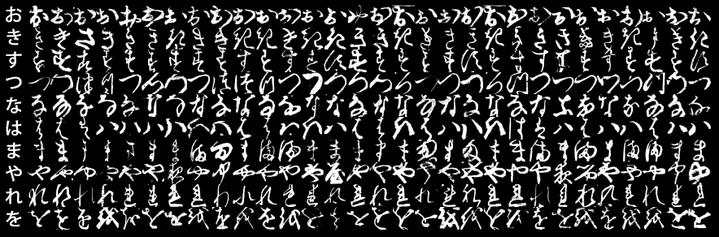
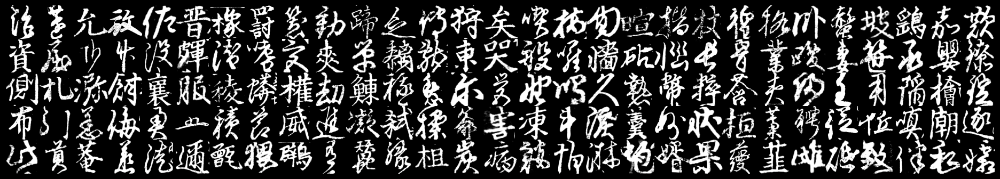

# Kuzushiji-MNIST

[](https://creativecommons.org/licenses/by-sa/4.0/)  
📚 [Read the paper](https://arxiv.org/abs/1812.01718) to learn more about Kuzushiji, the datasets and our motivations for making them!

## News and Updates
**IMPORTANT:** If you downloaded the KMNIST or K49 dataset before **5 February 2019**, please re-download the dataset and run your code again. We fixed minor image processing bugs and released an updated version, we find that the updated version gives slightly better performance. Thanks to [#1](https://github.com/rois-codh/kmnist/issues/1) and [#5](https://github.com/rois-codh/kmnist/issues/5) for bringing this to our attention.

## The Dataset

**Kuzushiji-MNIST** is a drop-in replacement for the MNIST dataset (28x28 grayscale, 70,000 images), provided in the original MNIST format as well as a NumPy format. Since MNIST restricts us to 10 classes, we chose one character to represent each of the 10 rows of Hiragana when creating Kuzushiji-MNIST.

**Kuzushiji-49**, as the name suggests, has 49 classes (28x28 grayscale, 270,912 images), is a much larger, but imbalanced dataset containing 48 Hiragana characters and one Hiragana iteration mark.

**Kuzushiji-Kanji** is an imbalanced dataset with a total of 3,832 Kanji characters (64x64 grayscale, 140,424 images), ranging from 1,766 examples to only a single example per class.

<p align="center">
  
  The 10 classes of Kuzushiji-MNIST, with the first column showing each character's modern hiragana counterpart.
</p>

## Get the data 💾

🌟 You can run [`python download_data.py`](download_data.py) to interactively select and download any of these datasets!

### Kuzushiji-MNIST

Kuzushiji-MNIST contains 70,000 28x28 grayscale images spanning 10 classes (one from each column of [hiragana](https://upload.wikimedia.org/wikipedia/commons/thumb/2/28/Table_hiragana.svg/768px-Table_hiragana.svg.png)), and is perfectly balanced like the original MNIST dataset (6k/1k train/test for each class).

| File            | Examples | Download (MNIST format)    | Download (NumPy format)      |
|-----------------|--------------------|----------------------------|------------------------------|
| Training images | 60,000             | [train-images-idx3-ubyte.gz](http://codh.rois.ac.jp/kmnist/dataset/kmnist/train-images-idx3-ubyte.gz) (18MB) | [kmnist-train-imgs.npz](http://codh.rois.ac.jp/kmnist/dataset/kmnist/kmnist-train-imgs.npz) (18MB)   |
| Training labels | 60,000             | [train-labels-idx1-ubyte.gz](http://codh.rois.ac.jp/kmnist/dataset/kmnist/train-labels-idx1-ubyte.gz) (30KB) | [kmnist-train-labels.npz](http://codh.rois.ac.jp/kmnist/dataset/kmnist/kmnist-train-labels.npz) (30KB)  |
| Testing images  | 10,000             | [t10k-images-idx3-ubyte.gz](http://codh.rois.ac.jp/kmnist/dataset/kmnist/t10k-images-idx3-ubyte.gz) (3MB) | [kmnist-test-imgs.npz](http://codh.rois.ac.jp/kmnist/dataset/kmnist/kmnist-test-imgs.npz) (3MB)   |
| Testing labels  | 10,000             | [t10k-labels-idx1-ubyte.gz](http://codh.rois.ac.jp/kmnist/dataset/kmnist/t10k-labels-idx1-ubyte.gz) (5KB)  | [kmnist-test-labels.npz](http://codh.rois.ac.jp/kmnist/dataset/kmnist/kmnist-test-labels.npz) (5KB) |

Mapping from class indices to characters: [kmnist_classmap.csv](http://codh.rois.ac.jp/kmnist/dataset/kmnist/kmnist_classmap.csv) (1KB)

We recommend using standard top-1 accuracy on the test set for evaluating on Kuzushiji-MNIST.

##### Which format do I download?
If you're looking for a drop-in replacement for the MNIST or Fashion-MNIST dataset (for tools that currently work with these datasets), download the data in MNIST format.

Otherwise, it's recommended to download in NumPy format, which can be loaded into an array as easy as:  
`arr = np.load(filename)['arr_0']`.

### Kuzushiji-49

Kuzushiji-49 contains 270,912 images spanning 49 classes, and is an extension of the Kuzushiji-MNIST dataset.

| File            | Examples |  Download (NumPy format)      |
|-----------------|--------------------|----------------------------|
| Training images | 232,365            | [k49-train-imgs.npz](http://codh.rois.ac.jp/kmnist/dataset/k49/k49-train-imgs.npz) (63MB)   |
| Training labels | 232,365            | [k49-train-labels.npz](http://codh.rois.ac.jp/kmnist/dataset/k49/k49-train-labels.npz) (200KB)  |
| Testing images  | 38,547             | [k49-test-imgs.npz](http://codh.rois.ac.jp/kmnist/dataset/k49/k49-test-imgs.npz) (11MB)   |
| Testing labels  | 38,547             | [k49-test-labels.npz](http://codh.rois.ac.jp/kmnist/dataset/k49/k49-test-labels.npz) (50KB) |

Mapping from class indices to characters: [k49_classmap.csv](http://codh.rois.ac.jp/kmnist/dataset/k49/k49_classmap.csv) (1KB)

We recommend using **balanced accuracy** on the test set for evaluating on Kuzushiji-49.  
We use the following implementation of balanced accuracy:
```python
p_test = # Model predictions of class index
y_test = # Ground truth class indices

accs = []
for cls in range(49):
  mask = (y_test == cls)
  cls_acc = (p_test == cls)[mask].mean() # Accuracy for rows of class cls
  accs.append(cls_acc)
  
accs = np.mean(accs) # Final balanced accuracy
```

### Kuzushiji-Kanji

Kuzushiji-Kanji is a large and highly imbalanced 64x64 dataset of 3,832 Kanji characters, containing 140,424 images of both common and rare characters.  

The full dataset is available for download [here](http://codh.rois.ac.jp/kmnist/dataset/kkanji/kkanji.tar) (310MB).  
We plan to release a train/test split version as a low-shot learning dataset very soon.



## Benchmarks & Results 📈

Have more results to add to the table? Feel free to submit an [issue](https://github.com/rois-codh/kmnist/issues/new) or [pull request](https://github.com/rois-codh/kmnist/compare)!

|Model                            | MNIST | Kuzushiji-MNIST | Kuzushiji-49 | Credit
|---------------------------------|-------|--------|-----|---|
|[4-Nearest Neighbour Baseline](benchmarks/kuzushiji_mnist_knn.py)     |97.14% | 92.10% | 83.65% |
|[PCA + 4-kNN](https://github.com/rois-codh/kmnist/issues/10) | 97.76% | 93.98% | 86.80% | [dzisandy](https://github.com/dzisandy)
|[Tuned SVM (RBF kernel)](https://github.com/rois-codh/kmnist/issues/3) | 98.57% | 92.82%\* |  85.61%\* | [TomZephire](https://github.com/TomZephire)
|[Keras Simple CNN Benchmark](benchmarks/kuzushiji_mnist_cnn.py)       |99.06% | 94.63% | 89.36% |
|PreActResNet-18                  |99.56% | 97.82%\* |96.64%\*|
|PreActResNet-18 + Input Mixup    |99.54% | 98.41%\* |97.04%\*|
|PreActResNet-18 + Manifold Mixup |99.54% | 98.83%\* | 97.33%\* |
|[ResNet18 + VGG Ensemble](https://github.com/ranihorev/Kuzushiji_MNIST) | 99.60% | 98.90%\* | | [Rani Horev](https://twitter.com/HorevRani)
|[DenseNet-100 (k=12)](https://github.com/janzd/pytorch_image_classification) | | | 97.32% | [Jan Zdenek](https://github.com/janzd)
|[Shake-Shake-26 2x96d (cutout 14)](https://github.com/janzd/pytorch_image_classification) | | | **98.29%** | [Jan Zdenek](https://github.com/janzd)
|[shake-shake-26 2x96d (S-S-I), Cutout 14](https://github.com/hysts/pytorch_image_classification#results-on-kuzushiji-mnist) | **99.76%** | **99.34%\*** | | [hysts](https://github.com/hysts)

_\* These results were obtained using an old version of the dataset, which gave slightly lower performance numbers_

For MNIST and Kuzushiji-MNIST we use a standard accuracy metric, while Kuzushiji-49 is evaluated using balanced accuracy (so that all classes have equal weight).

## Citing Kuzushiji-MNIST

If you use any of the Kuzushiji datasets in your work, we would appreciate a reference to our paper:

**Deep Learning for Classical Japanese Literature. Tarin Clanuwat et al. [arXiv:1812.01718](https://arxiv.org/abs/1812.01718)**

```latex
@online{clanuwat2018deep,
  author       = {Tarin Clanuwat and Mikel Bober-Irizar and Asanobu Kitamoto and Alex Lamb and Kazuaki Yamamoto and David Ha},
  title        = {Deep Learning for Classical Japanese Literature},
  date         = {2018-12-03},
  year         = {2018},
  eprintclass  = {cs.CV},
  eprinttype   = {arXiv},
  eprint       = {cs.CV/1812.01718},
}
```

## License

Both the dataset itself and the contents of this repo are licensed under a permissive  [CC BY-SA 4.0](https://creativecommons.org/licenses/by-sa/4.0/) license, except where specified within some benchmark scripts. CC BY-SA 4.0 license requires attribution, and we would suggest to use the following attribution to the KMNIST dataset.

"KMNIST Dataset" (created by CODH), adapted from "Kuzushiji Dataset" 
(created by NIJL and others), doi:10.20676/00000341

## Related datasets

Kuzushiji Dataset http://codh.rois.ac.jp/char-shape/ offers 4,328 character types and 1,086,326 character images (November 2019) with CSV files containing the bounding box of characters on the original page images. At this moment, the description of the dataset is available only in Japanese, but the English version will be available soon. 
